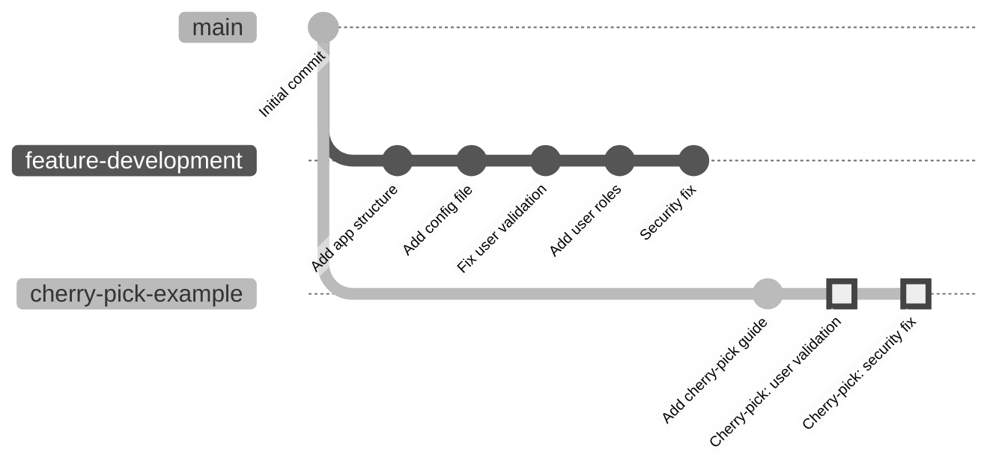
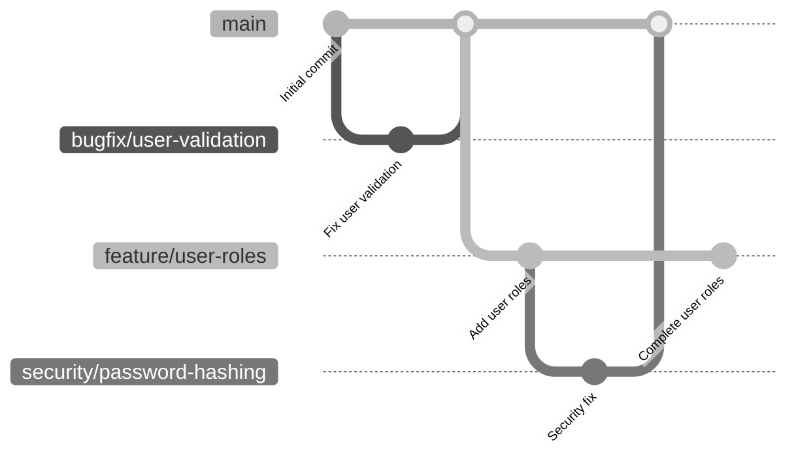

# Visual Cherry-Pick Diagram

Below is a visual representation of the cherry-pick process:

## Understanding the Diagram

1. We start with an initial commit on the `main` branch
2. We create and checkout a `feature-development` branch
3. We make several commits on `feature-development`:
   - Add app structure
   - Add config file
   - Fix user validation (Bug fix)
   - Add user roles (Feature)
   - Security fix (Security improvement)
4. We create and checkout a `cherry-pick-example` branch from `main`
5. We add a cherry-pick guide on this branch
6. We cherry-pick two specific commits (highlighted):
   - The user validation fix
   - The security fix

## Benefits Illustrated

This diagram shows the key benefit of cherry-picking: We've applied specific, important fixes from our feature branch without bringing in the entire feature implementation.

## When to Use This Pattern

Cherry-picking is ideal for:

1. **Hotfixes**: When you need to apply a critical fix to production without waiting for all feature work to be completed
2. **Backporting**: When you need to apply a new fix to an older maintenance release
3. **Salvaging work**: When you want to rescue specific changes from a branch that might otherwise be abandoned

## Best Practices for Clean History

When cherry-picking:

- Keep commits small and focused on a single change
- Write clear commit messages that explain not just what changed, but why
- Consider using the `-x` flag (`git cherry-pick -x <commit>`) to add a reference to the original commit
- After cherry-picking, test thoroughly to ensure the changes work as expected in the new context

## Possible Issues

Be aware that cherry-picking can sometimes cause:

- Merge conflicts (if the target branch has diverged significantly)
- Duplicate fixes (if you later merge the entire feature branch)
- Complex history (making it harder to track where changes originated)

## Alternative Approach: Using Branches

Another approach would be to create feature branches from the beginning with potential cherry-picking in mind:

This approach can make cherry-picking unnecessary, as each logical change gets its own branch that can be merged independently.
